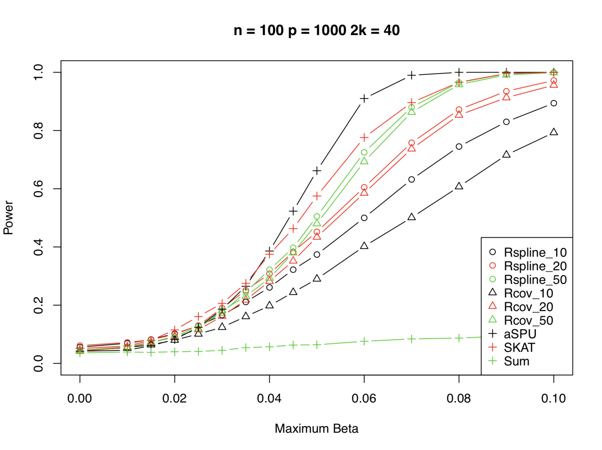
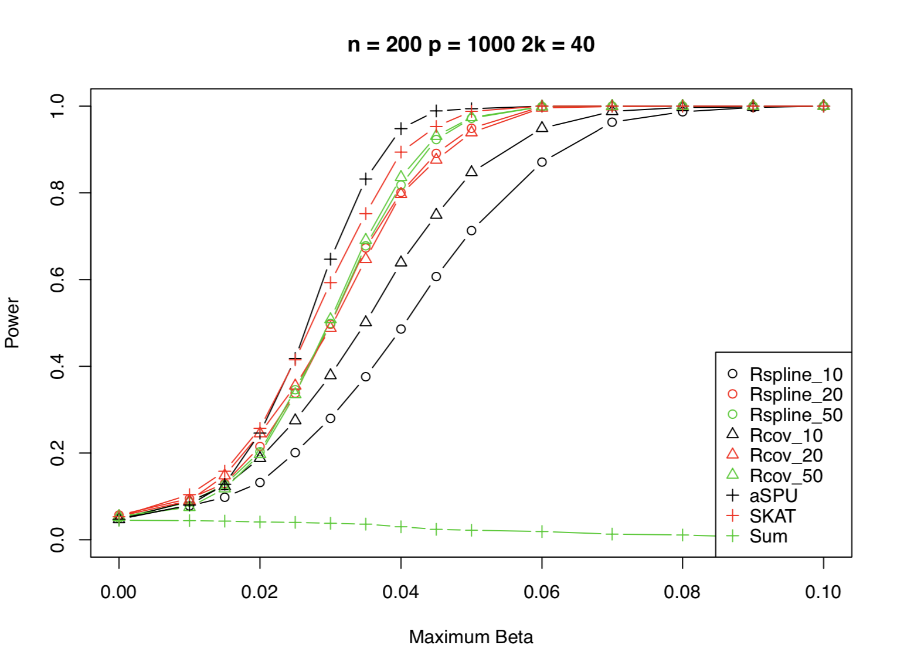

```{r setup, include = FALSE}
knitr::opts_chunk$set(
  eval = FALSE,
  collapse = TRUE,
  comment = "#>"
)
```

## Overview

The simulation in this package was one presented in [Vandekar et al. (2018)](https://www.tandfonline.com/doi/pdf/10.1080/01621459.2018.1448826?needAccess=true&) as part of a demonstration of the power results for the newly developed projected score test (PST), comparing it to the sequence kernel association test (SKAT), the adaptive sum of pwered scores test (aSPU), and the sum of powered scores test (SPU), specifically the plots in Figure 3. The paper presents a method to test the association of a single outcome with a high-dimensional variable such as an imaging or a genetic variable. Instead of using summary measures to test this association, which can result in underpowered subsequent tests used to localize an association, this method avoids this two-stage testing approach and directly identifies regions that are associated with an outcome of interest. Specifically, the authors propose a generalization of Rao's score test, which projects a score statistic onto a linear subspace of a high-dimensional parameter space. Here, the score statistics are projected to the subspace where the score test was performed, which allows inference in the high-dimensional space to be performed with the same degrees of freedom as the score test itself. This method has power that is competitive with other tests that do similar things. 


## Installation

To install the package from github, type:
```{r}
devtools::install_github("carolynlou/pstestr")
```

All dependencies of this package are imported with it.


## Tutorial

There is only one function that is required to run the entire simulation, and it is populated with default values for the parameters. This simulation runs quite slowly though, so here we show how to run it with and without parallelization:

Without parallelization: 
```{r}
pst_sim()
```

With parallelization: 
```{r}
ncores = detectCores()
pst_sim(mc.cores = ncores)
```

If more control is desired for what exactly is run, the same simulations can be run with the following code.


Here, we set up the simulations with the default parameters, making sure to save the output matrices from the `sim_setup()` function for use in following steps. The main default parameters to be aware of are `nsim` and `seed`, where `nsim` will heavily affect runtime, and `seed` allows for reproducible results. Note that even if a seed is set outside of the function, the internal seed will still be automatically set to `2019`, so if a user wants to run this simulation under different random settings, the `seed` parameter in the function would have to be manually set. 

```{r}
sobj = sim_setup(nsim = 500, seed = 2019,
                     n = 100, p = 1000,
                     model = 'normal',
                     sigma = 1,
                     rho = 0.9,
                     rs = c(10, 20, 50))
Gprime = sobj$Gprime
GQs = sobj$GQs
GQs2 = sobj$GQs2
R1nams = sobj$R1nams
R2nams = sobj$R2nams
nams = sobj$nams
simresults = sobj$simresults
powresults = sobj$powresults
H1 = sobj$H1
A = sobj$A
G = sobj$G
linkatlambda = sobj$linkatlambda
```


The following line of code runs the power calculation for the default parameters, with the default seed `2019`. To run across multiple parameter settings for `mbeta` and `kperc`, simply wrap in an `apply` statement or a for loop.

```{r}
pstest(nsim = 500, seed = 2019, mbeta = 0, kperc = 40,
       n = 100, p = 1000, model = 'normal', sigma = 1,
       alpha = 0.05, betasp = TRUE, rs = c(10, 20, 50), mc.cores = 1,
       Gprime = Gprime, GQs = GQs,
       GQs2 = GQs2, R1nams = R1nams, R2nams = R2nams,
       nams = nams, H1 = H1,
       A = A, G = G, linkatlambda = linkatlambda,
       simresults = simresults,
       powresults = powresults)
```

Sample output plot is shown below:

```{r, echo = FALSE, eval = TRUE, out.width= '50%'}


```


